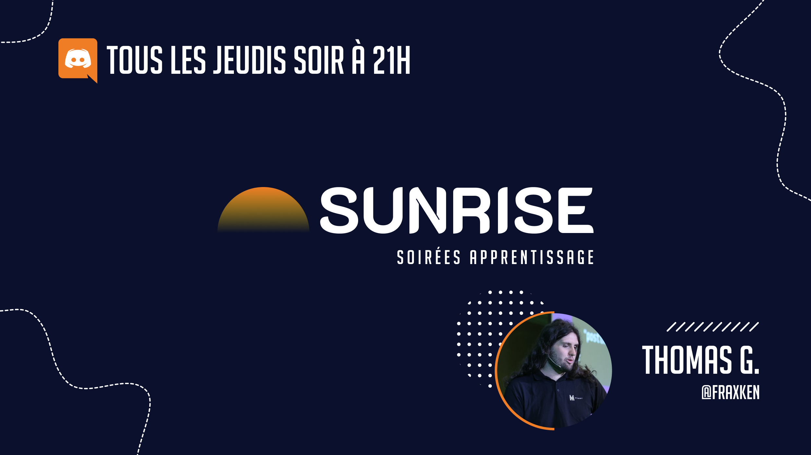

  <h1 align="center">Sunrise 🌅</h1>

Soirée apprentissage et collaboration avec [Thomas.G](https://www.linkedin.com/in/thomas-gentilhomme/) ([@fraxken](https://twitter.com/fraxken)) sur Discord tous les **jeudis** soirs de la semaine à **21h**.

> Le discord OpenAlly est un lieu d'échanges pour divers projets open source. Si vous êtes à la recherche d'une communauté sur JavaScript et Node.js, nous vous recommandons: [ES-Community](https://github.com/ES-Community/Code-of-conduct).

Chaque session aura un nombre limité de places disponible (de **cinq** à **dix** selon le sujet).

Si vous êtes un(e) développeur(euse) junior, venir à ces soirées peut vous être bénéfique pour plusieurs raisons;
- Pouvoir faire connaissance, interagir et collaborer avec différents développeurs/développeuses.
- Apprendre de nouvelles choses sur Javascript, Node.js et autres (dans la mesure des compétences des différents intervenants).
- Avoir des opportunités de contribuer sur des projets open source.

Certaines soirées auront des thèmes plus précis que d'autres. À noter qu'elles ne seront pas nécessairement toutes préparées... Certaines sessions se concentreront plus sur le parcours, les difficultés et volontés des participants.

> Nous enregistrerons les soirées avec thème pour partager au plus grand nombre sur Youtube.

## Quelques règles à impérativement respecter

- Avoir un microphone et casque **fonctionnel**.
- Avoir une connexion internet avec un **débit suffisant** pour l'audio et le partage d'écran.
- Venir participer avec un esprit de **bienveillance**.

> Je me laisse le droit de vous renvoyer d'une session ou du Discord si je n'apprécie pas votre comportement.

---

Pour qui ?

Ces sessions sont principalement pour des développeurs Javascript (avec de préférence une affinité ou un intérêt pour des sujets back-end). Je ne me considère pas front-end alors je ne couvrirai pas de sujets/outils sur ce spectre-là.

Comment participer ?

Tout d'abord penser à vous présenter sur le Discord.

N'hésitez pas à vous manifester dans le salon `#home` de la catégorie Sunrise pour participer à une session (si le soir même des places sont toujours disponibles vous pourrez rejoindre librement).

Pourquoi le nom "Sunrise" ?

1. Mon idée/ma volonté est d'accompagner et de faire naître des nouveaux talents (l'idée du lever de soleil me semblait donc cohérente et plutôt sympa).
2. C'est organisé le soir et je trouvais drôle d'avoir un lever de soleil quant au contraire le soleil se couchera lors des sessions.
3. J'aime beaucoup la culture nippone et j'apprécie l'idée que cela puisse faire aussi référence au pays du soleil levant.

